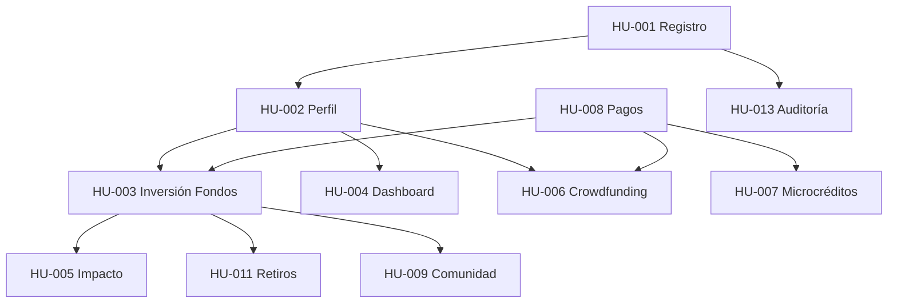

# 📚 ÍNDICE DE HISTORIAS DE USUARIO - FINTECH VERDE COLOMBIA

## Información del Proyecto

**Proyecto:** Plataforma Fintech de Inversiones Verdes  
**Versión:** 1.0  
**Fecha:** 22 de octubre de 2025  
**Metodología:** Scrum/Agile con sprints de 2 semanas

---

## 📋 Resumen Ejecutivo

Este documento contiene el índice maestro de todas las historias de usuario del proyecto de plataforma fintech verde. Las historias están organizadas por módulos funcionales y priorizadas según el método MoSCoW (MUST, SHOULD, COULD, WON'T).

**Total de Historias de Usuario:** 12+  
**Puntos de Historia Totales:** ~80 puntos  
**Sprints Estimados:** 4-6 sprints

---

## 🗂️ ÉPICAS Y MÓDULOS

### ÉPICA 1: RF-001 - GESTIÓN DE USUARIOS Y ONBOARDING

**Objetivo:** Permitir que nuevos usuarios se registren, verifiquen su identidad y configuren su perfil financiero/ambiental de manera rápida y segura.

| ID         | Título                                                        | Prioridad | Puntos | Sprint | Estado         |
| ---------- | ------------------------------------------------------------- | --------- | ------ | ------ | -------------- |
| **HU-001** | Registro rápido de usuario con verificación de identidad      | MUST      | 8      | 1      | ✅ Documentado |
| **HU-002** | Configuración de perfil financiero y motivaciones ambientales | MUST      | 5      | 1      | ✅ Documentado |

**Subtotal Épica 1:** 13 puntos

---

### ÉPICA 2: RF-002 - PRODUCTOS FINANCIEROS VERDES

**Objetivo:** Implementar los productos financieros core: fondos de inversión verde, crowdfunding de proyectos y microcréditos verdes.

| ID         | Título                                                     | Prioridad | Puntos | Sprint | Estado         |
| ---------- | ---------------------------------------------------------- | --------- | ------ | ------ | -------------- |
| **HU-003** | Invertir en fondos diversificados de proyectos ambientales | MUST      | 13     | 2      | ✅ Documentado |
| **HU-006** | Crowdfunding directo de proyectos ambientales específicos  | SHOULD    | 8      | 3      | 📝 Pendiente   |
| **HU-007** | Solicitud y aprobación de microcréditos verdes             | COULD     | 13     | 4      | 📝 Pendiente   |

**Subtotal Épica 2:** 34 puntos

---

### ÉPICA 3: RF-003 - DASHBOARD Y EXPERIENCIA DE USUARIO

**Objetivo:** Crear una experiencia de usuario excepcional con dashboards personalizados, tracking de impacto y visualizaciones interactivas.

| ID         | Título                                                      | Prioridad | Puntos | Sprint | Estado         |
| ---------- | ----------------------------------------------------------- | --------- | ------ | ------ | -------------- |
| **HU-004** | Visualizar dashboard personalizado con portafolio e impacto | MUST      | 8      | 2      | ✅ Documentado |
| **HU-005** | Calcular y visualizar impacto ambiental de inversiones      | MUST      | 8      | 3      | ✅ Documentado |

**Subtotal Épica 3:** 16 puntos

---

### ÉPICA 4: RF-004 - FUNCIONALIDADES SOCIALES Y EDUCATIVAS

**Objetivo:** Construir comunidad y educar a los usuarios sobre finanzas sostenibles.

| ID         | Título                                          | Prioridad | Puntos | Sprint | Estado       |
| ---------- | ----------------------------------------------- | --------- | ------ | ------ | ------------ |
| **HU-009** | Sistema de comentarios y comunidad en proyectos | SHOULD    | 5      | 4      | 📝 Pendiente |
| **HU-010** | Centro de educación financiera verde            | SHOULD    | 8      | 5      | 📝 Pendiente |

**Subtotal Épica 4:** 13 puntos

---

### ÉPICA 5: RF-005 - INTEGRACIONES Y PROCESAMIENTO DE PAGOS

**Objetivo:** Integrar pasarelas de pago colombianas y gestionar transacciones de forma segura.

| ID         | Título                                        | Prioridad | Puntos | Sprint | Estado       |
| ---------- | --------------------------------------------- | --------- | ------ | ------ | ------------ |
| **HU-008** | Integración con pasarelas de pago colombianas | MUST      | 13     | 1-2    | 📝 Pendiente |
| **HU-011** | Sistema de retiros y liquidaciones            | MUST      | 8      | 3      | 📝 Pendiente |

**Subtotal Épica 5:** 21 puntos

---

### ÉPICA 6: RF-006 - REPORTERÍA Y CUMPLIMIENTO

**Objetivo:** Garantizar cumplimiento regulatorio con reportes automáticos y auditoría completa.

| ID         | Título                                         | Prioridad | Puntos | Sprint | Estado       |
| ---------- | ---------------------------------------------- | --------- | ------ | ------ | ------------ |
| **HU-012** | Generación automática de reportes regulatorios | MUST      | 13     | 5      | 📝 Pendiente |
| **HU-013** | Sistema de auditoría y trazabilidad completa   | MUST      | 8      | 2      | 📝 Pendiente |

**Subtotal Épica 6:** 21 puntos

---

## 📊 BACKLOG PRIORIZADO

### Sprint 1 (Semanas 1-2) - FUNDACIÓN

**Objetivo:** Registro de usuarios e infraestructura de pagos

- [x] HU-001: Registro de usuario (8 pts)
- [x] HU-002: Perfil de riesgo e intereses (5 pts)
- [ ] HU-008: Integración pasarelas de pago (13 pts - iniciar)

**Total Sprint 1:** 26 puntos

---

### Sprint 2 (Semanas 3-4) - PRODUCTO CORE

**Objetivo:** Inversiones y visualización

- [x] HU-003: Inversión en fondos verdes (13 pts)
- [x] HU-004: Dashboard principal (8 pts)
- [ ] HU-008: Integración pasarelas de pago (continuar)
- [ ] HU-013: Auditoría y trazabilidad (8 pts)

**Total Sprint 2:** 29 puntos

---

### Sprint 3 (Semanas 5-6) - IMPACTO Y DIVERSIFICACIÓN

**Objetivo:** Tracking de impacto y más opciones de inversión

- [x] HU-005: Tracking de impacto ambiental (8 pts)
- [ ] HU-006: Crowdfunding de proyectos (8 pts)
- [ ] HU-011: Retiros y liquidaciones (8 pts)

**Total Sprint 3:** 24 puntos

---

### Sprint 4 (Semanas 7-8) - COMUNIDAD Y MICROCRÉDITOS

**Objetivo:** Funcionalidades sociales y nuevos productos

- [ ] HU-007: Microcréditos verdes (13 pts)
- [ ] HU-009: Comentarios y comunidad (5 pts)

**Total Sprint 4:** 18 puntos

---

### Sprint 5 (Semanas 9-10) - EDUCACIÓN Y COMPLIANCE

**Objetivo:** Contenido educativo y cumplimiento regulatorio

- [ ] HU-010: Centro educativo (8 pts)
- [ ] HU-012: Reportes regulatorios (13 pts)

**Total Sprint 5:** 21 puntos

---

## 🎯 ROADMAP VISUAL

```
Sprint 1        Sprint 2        Sprint 3        Sprint 4        Sprint 5
[========]      [========]      [========]      [========]      [========]
Registro        Inversión       Impacto         Comunidad       Educación
Perfil          Dashboard       Crowdfund       Microcréditos   Reportes
Pagos (I)       Pagos (II)      Retiros         Social          Compliance
                Auditoría
```

---

## 📈 MÉTRICAS Y KPIs POR HISTORIA

| Historia | Métrica de Éxito                   | Target   | Método de Medición                              |
| -------- | ---------------------------------- | -------- | ----------------------------------------------- |
| HU-001   | Tasa de registro completado        | >80%     | (Registros completos / Iniciados) × 100         |
| HU-001   | Tiempo promedio de registro        | <5 min   | Analytics de tiempo de sesión                   |
| HU-002   | Tasa de completación de perfil     | >90%     | (Perfiles completos / Registros) × 100          |
| HU-003   | Primera inversión dentro de 7 días | >40%     | (Usuarios que invierten / Total usuarios) × 100 |
| HU-003   | Valor promedio primera inversión   | >$50,000 | Promedio de primeras inversiones                |
| HU-004   | Tiempo de carga del dashboard      | <2 seg   | Herramientas de performance monitoring          |
| HU-005   | Descargas de certificados          | >500/mes | Contador de descargas                           |
| HU-005   | Compartidos en RRSS                | >200/mes | Tracking de shares                              |

---

## 🔗 DEPENDENCIAS ENTRE HISTORIAS



---

## 📝 PLANTILLA Y ESTÁNDARES

**Plantilla Base:** `/historias_usuario/00_PLANTILLA_historia_usuario.md`

**Formato de Nomenclatura:** `HU-XXX_descripcion_breve.md`

**Estructura Estándar:**

- Formato: User Story (Como... Quiero... Para...)
- Criterios de Aceptación: Gherkin (Dado... Cuando... Entonces...)
- Validación: Principios INVEST
- Estimación: Puntos de Historia (Fibonacci: 1, 2, 3, 5, 8, 13, 21)

---

## 👥 ROLES Y RESPONSABILIDADES

| Rol            | Responsable | Responsabilidades                          |
| -------------- | ----------- | ------------------------------------------ |
| Product Owner  | [Nombre]    | Priorizar backlog, validar historias       |
| Scrum Master   | [Nombre]    | Facilitar ceremonias, remover impedimentos |
| Tech Lead      | [Nombre]    | Revisión técnica, arquitectura             |
| Equipo Dev     | [Nombres]   | Implementación, pruebas                    |
| QA             | [Nombre]    | Validar criterios de aceptación            |
| UX/UI Designer | [Nombre]    | Mockups, validación de usabilidad          |

---

## 📚 DOCUMENTOS RELACIONADOS

- `4a. functional_requirements.md` - Requisitos funcionales base
- `4b. non_functional_requirements.md` - Requisitos no funcionales
- `5a. requirements_validation_template.md` - Validación de requisitos
- `README.md` - Visión general del proyecto

---

## 🔄 PROCESO DE ACTUALIZACIÓN

1. **Creación de Nueva Historia:**

   - Usar plantilla base (`00_PLANTILLA_historia_usuario.md`)
   - Asignar ID secuencial
   - Vincular a épica/módulo
   - Actualizar este índice

2. **Refinamiento:**

   - Sesión de refinamiento semanal
   - Validar criterios de aceptación con PO
   - Estimar con planning poker

3. **Tracking:**
   - Actualizar estado en este índice
   - Mantener sincronizado con herramienta de gestión (Jira/Azure DevOps)

---

## ✅ CHECKLIST DE HISTORIA COMPLETA

Una historia está lista para desarrollo cuando:

- [ ] Tiene formato de User Story completo
- [ ] Criterios de aceptación en Gherkin
- [ ] Reglas de negocio documentadas
- [ ] Estimada en puntos de historia
- [ ] Validada con principios INVEST
- [ ] Dependencias identificadas
- [ ] Mockups/wireframes disponibles (si aplica)
- [ ] Aprobada por Product Owner
- [ ] Casos de prueba principales definidos

---

## 📞 CONTACTOS Y RECURSOS

**Repositorio:** [URL del repositorio]  
**Documentación:** [URL de la wiki]  
**Prototipo:** [URL de Figma/Adobe XD]  
**Backlog Digital:** [URL de Jira/Azure DevOps]

---

## 🔖 VERSIONES DE ESTE DOCUMENTO

| Versión | Fecha       | Autor              | Cambios                             |
| ------- | ----------- | ------------------ | ----------------------------------- |
| 1.0     | 22/10/2025  | Equipo de Análisis | Creación inicial con primeras 5 HUs |
| 1.1     | [Pendiente] | [Pendiente]        | Completar HUs restantes             |

---

**Última actualización:** 22 de octubre de 2025  
**Próxima revisión:** Sprint Planning - Semana 1
